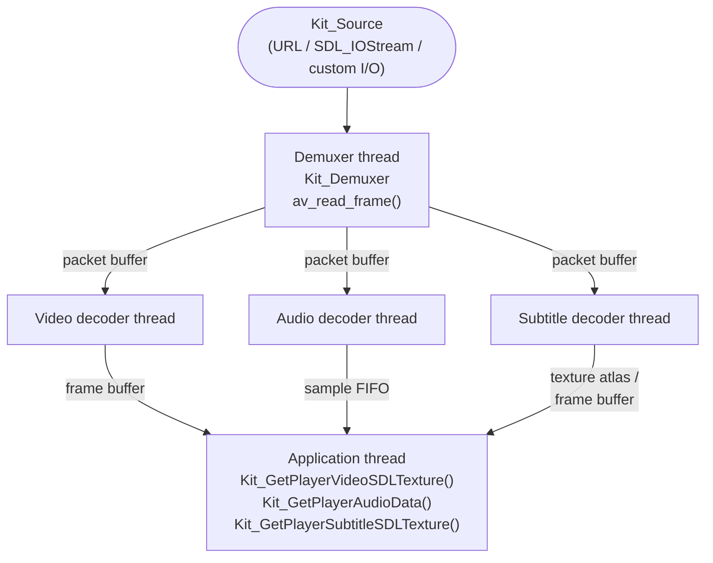
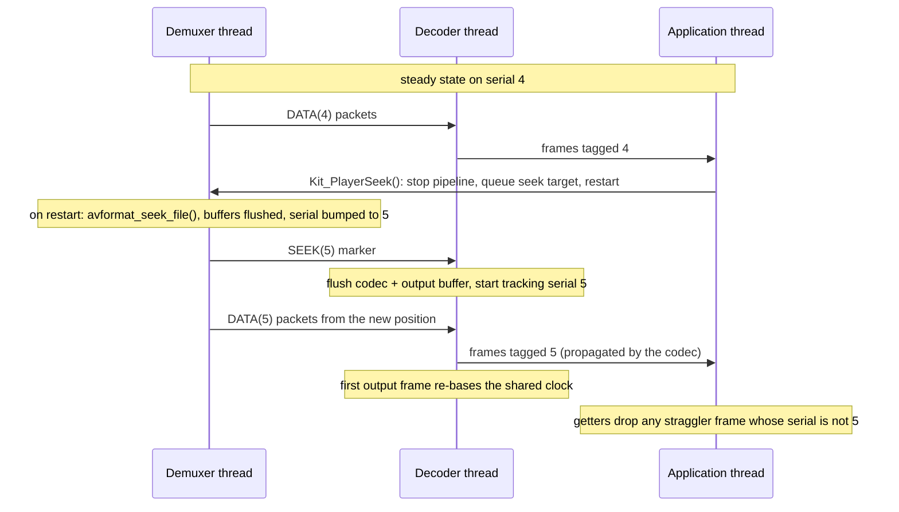

# Architecture

This page describes how the repository is laid out and how the library works
internally. It is aimed at people working on SDL_kitchensink itself; for
using the library, see the [API documentation](https://katajakasa.github.io/SDL_kitchensink/)
and the `examples/` directory.

## 1. Repository layout

```
include/kitchensink3/           Public API headers (installed)
include/kitchensink3/internal/  Internal headers (not installed)
src/                            Public API implementation
src/internal/                   Demuxer, decoders, threads, buffers
src/internal/audio/             Audio decoder + resampling
src/internal/video/             Video decoder + scaling/conversion
src/internal/subtitle/          Subtitle decoder, atlas, renderers
src/internal/utils/             Small shared helpers
examples/                       Example programs (BUILD_EXAMPLES=1)
tests/                          Test suite, see docs/TESTING.md
test-data/                      Committed test media + its generator
cmake/                          CMake find modules and helpers
docs/                           This developer documentation
```

## 2. Public API vs internals

Everything under `include/kitchensink3/*.h` is public, stable API, split by
topic -- lifecycle, sources, the player, errors, formats, codecs, utils, and
the export macros in `kitconfig.h` -- with `kitchensink.h` as an umbrella
header pulling in all of them. These headers are installed, documented with
Doxygen, and changing them incompatibly is a major-version event.

Everything under `include/kitchensink3/internal/` and `src/internal/` is
private. Internal symbols are marked `KIT_LOCAL` (hidden visibility in shared
builds, see `kitconfig.h`) and may change freely between releases. Tests link
the static library, so they can and do test internal components directly.

Errors are reported through `Kit_SetError()` and read with `Kit_GetError()`;
the error message storage is thread-local (SDL TLS), so each thread sees only
its own errors.

## 3. The playback pipeline

A `Kit_Player` runs a pipeline of one demuxer thread and up to three decoder
threads (video, audio, subtitle -- one per selected stream). The application's
own thread is the final consumer, pulling output through the `Kit_GetPlayer*`
functions.



Stage by stage:

* **`Kit_Source`** wraps an FFmpeg `AVFormatContext`. It can be created from
  a URL, an `SDL_IOStream`, or custom read/seek callbacks.
* **`Kit_Demuxer`**, driven by its **`Kit_DemuxerThread`**, reads packets
  from the source and routes each one into a per-stream-type
  **`Kit_PacketBuffer`**. Packets for unselected streams are dropped, and on
  EOF the thread writes an EOF-tagged sentinel packet into every active buffer
  so the decoders know to drain.
* **`Kit_Decoder`** is a generic wrapper that owns the `AVCodecContext` and
  handles hardware-decoder negotiation. The type-specific behavior (decode,
  flush, abort, output buffering) is plugged in through callbacks by the
  audio, video and subtitle decoders. Each decoder is driven by its own
  **`Kit_DecoderThread`**, which pulls packets from the demuxer's packet
  buffer, feeds them to the codec, and pushes decoded output into the
  decoder's output buffer.
* **Output** happens on the application's thread: video frames are
  synchronized against the playback clock and uploaded to an SDL texture (or
  locked for raw access), audio is read out as interleaved samples sized for
  the audio backend's buffer, and subtitles are rendered onto a texture
  atlas or returned as raw frames.

### 3.1. Packet buffers

`Kit_PacketBuffer` is the mechanism that decouples the threads: a thread-safe,
fixed-capacity ring buffer of pre-allocated slots, with the slot type
abstracted behind callbacks, so the same structure carries `AVPacket`s between
demuxer and decoders and decoded frames on the output side.

Writes block while the buffer is full and reads can block (with a timeout)
while it is empty -- this provides natural backpressure: when the application
stops consuming, decoder output buffers fill, decoder threads stall on their
writes, the demuxer's packet buffers fill, and the demuxer thread stalls
too. `Kit_AbortPacketBuffer()` wakes all waiters and makes their calls fail,
which is how shutdown avoids deadlocking on blocked threads; a subsequent
flush clears the aborted state.

### 3.2. Clock and seeking

Playback is synchronized against a single clock value that the player, the
demuxer and the decoders all hold reference-counted handles onto, so it
outlives whichever of them is torn down first. One stream is the
primary sync source -- video when present, otherwise audio -- meaning its
decoder is allowed to (re)base the shared clock; output is then shown,
skipped or delayed relative to the clock within the configurable early/late
thresholds of `Kit_PlayerConfig`.

Seeking halts the whole pipeline rather than trying to redirect it mid-flight:
`Kit_PlayerSeek()` stops the threads, hands the target to the demuxer, and
restarts them. A successful seek bumps the timer's *serial*, which is what
tells frames decoded before the seek apart from frames decoded after it, so
stale output can be discarded and the clock re-based on the primary stream's
first new frame. The next section describes how that serial travels.

### 3.3. In-band control packets and seek serials

The pipeline threads never signal each other directly; everything a decoder
needs to know travels in-band, through the same packet buffers as the data.
Every `AVPacket` and `AVFrame` moving between threads carries a small tag in
its `opaque` field: a packet type and a *seek serial*, bit-packed into the
pointer value by `kitpackettag.h`, so tagging costs no allocation.

There are three packet types:

* `DATA` -- carries stream data, stamped with the serial current at the time
  the demuxer routed it.
* `EOF` -- a sentinel written into every active packet buffer when the demuxer
  reaches the end of the input, telling the decoders to drain.
* `SEEK` -- a sentinel written into every active packet buffer after a
  successful seek, carrying the new serial.

Since the sentinels ride the same ring buffer as the data, their ordering
relative to the data packets is inherent: a decoder is guaranteed to see the
seek marker before any post-seek packet, with no separate synchronization.
Stream switching relies on the same in-band property: after a switch, the
decoder thread simply drops in-flight packets whose stream index does not
match its stream.

Serials have to survive decoding to be useful. The codec context is opened
with `AV_CODEC_FLAG_COPY_OPAQUE`, so libavcodec
carries each packet's tag to the frame decoded from that packet -- this keeps
frame serials correct even when frame-threaded decoding reorders output
around a seek. From there, the output frames get their tag as follows:

* **Video** -- inherits the decoded frame's tag through the normal frame moves
  and property copies.
* **Audio** -- output frames are cut from a resample FIFO and have no single
  source packet, so the decoder stamps them with the serial of the frames that
  went into the FIFO; the FIFO is reset on every seek and flush, so it can
  never hold a mix of serials.
* **Subtitles** -- do not carry serials at all; the renderer buffers are simply
  flushed on seek.

On the consumer side, the video and audio getters simply compare each frame's
serial against the timer's current serial and discard mismatches.

One full seek, end to end:



### 3.4. Thread lifecycle

Thread stop is a two-step protocol, visible throughout the internal APIs:
clearing a thread's run flag only asks it to exit at its next loop check,
while a thread blocked on a full/empty packet buffer must additionally be
woken through the abort call of its buffer/decoder/demuxer, or the join would
deadlock. The `Kit_Close*` functions bundle stop + abort + join in the right
order.

## 4. Subtitles

Subtitle rendering sits behind a small renderer abstraction with two
implementations: text-based formats (SRT, SSA/ASS) are rendered through
libass, while bitmap subtitle formats (e.g. DVD/VobSub) have their own
renderer. Rendered bitmaps are packed into a texture atlas so a frame's
worth of subtitle fragments can be drawn from a single texture.

libass itself is used either as a normal link-time dependency, or -- with the
`USE_DYNAMIC_LIBASS` CMake option -- loaded at runtime via `SDL_LoadSO()`,
in which case an internal header mirrors the needed libass API as function
pointers. Either way, the library-wide singleton `Kit_LibraryState` holds the
init flags and libass handles.

## 5. Fault injection

With the `KIT_FAULT_INJECTION` CMake option, a fault-injection registry is
compiled in and fallible spots in the library start checking named fail points
through it, letting tests deterministically fail allocations, I/O, decoder
calls and resource creation to exercise error paths. It exists for the test
suite and must never be enabled in production builds. See
[TESTING.md](TESTING.md).
